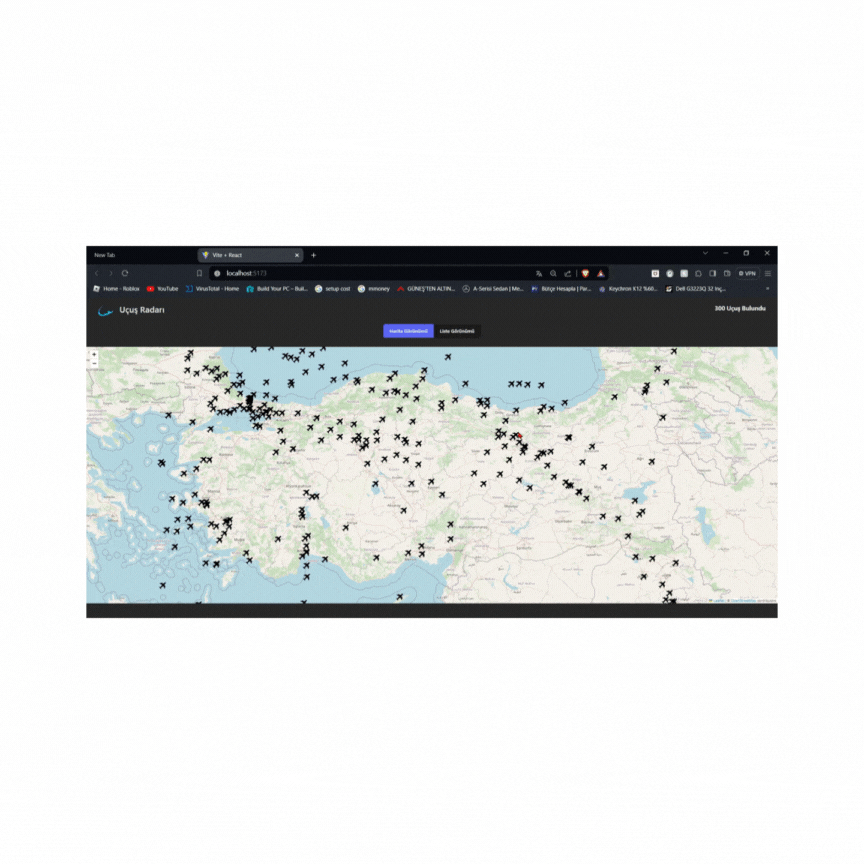

# flight-radar
This project appears to be a comprehensive web application that effectively manages flight data and allows users to visualize flights on a map. Here are some key features and technologies used in the project:

# Redux and FlightSlice:
- The use of Redux to manage flight data enables the storage and updating of data throughout the application.
FlightSlice is a custom Redux slice used to load flight data and store error states.
- An async thunk (GetFlights) is employed to send API requests using Axios, and the retrieved data is saved to the Redux store.

# Map and List Views:
- The map view is created using the react-leaflet library, displaying flights with customized airplane icons.
- The list view presents flights in a tabular format and provides a detail button for each flight.

# Flight Details:
- Flight details are displayed by clicking on airplane icons or detail buttons in the list view.
Data is fetched using an API request and presented on a detailed page.

# Pagination:
- Pagination is used in the list view to display a limited number of flight items per page.
- The react-paginate library generates page numbers and facilitates navigation between pages.

# Style and Visual Design:
- CSS styling is applied to the application for visual enhancements.
- Data is displayed in detailed pop-up windows and other components in a visually appealing manner.

# Additional Features:
- Links in flight details are designed to be clickable, allowing users easy access to airport websites.
- Flight status icons are displayed with background colors corresponding to the respective status.

# Storage and Optimization:
- The Redux store manages flight data for sharing between different components.
- Preloading and caching of data enhance page transition speed, improving the overall user experience.

# Libraries:
@reduxjs/toolkit
react-redux
axios
bootstrap
leaflet
react-leaflet

